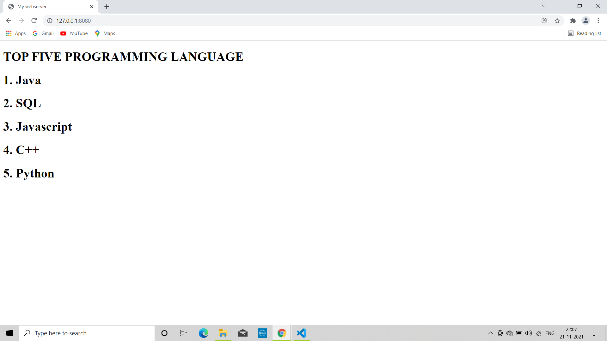
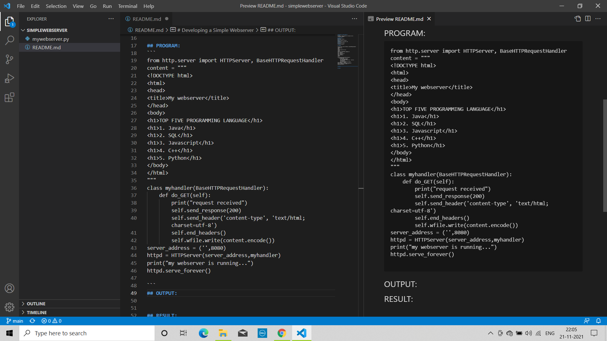

# Developing a Simple Webserver
## AIM:
To develop a simple webserver to display top five programming languages.

## DESIGN STEPS:
### Step 1: 
HTML content creation
### Step 2:
Design of webserver workflow
### Step 3:
Implementation using Python code
### Step 4:
Serving the HTML pages.
### Step 5:
Testing the webserver

## PROGRAM:
```
from http.server import HTTPServer, BaseHTTPRequestHandler
content = """
<!DOCTYPE html>
<html>
<head>
<title>My webserver</title>
</head>
<body>
<h1>TOP FIVE PROGRAMMING LANGUAGE</h1>
<h1>1. Java</h1>
<h1>2. SQL</h1>
<h1>3. Javascript</h1>
<h1>4. C++</h1>
<h1>5. Python</h1>
</body>
</html>
"""
class myhandler(BaseHTTPRequestHandler):
    def do_GET(self):
        print("request received")
        self.send_response(200)
        self.send_header('content-type', 'text/html; charset=utf-8')
        self.end_headers()
        self.wfile.write(content.encode())
server_address = ('',8080)
httpd = HTTPServer(server_address,myhandler)
print("my webserver is running...")
httpd.serve_forever()

```
## OUTPUT:

## CLIENT SIDE OUTPUT:



## SERVER SIDE OUTPUT:


## RESULT:

A webserver is developed to display top five programming languages.
